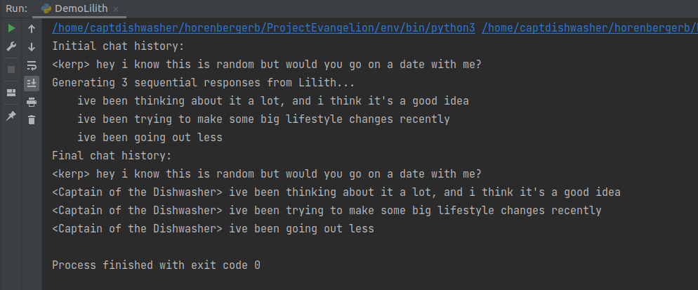
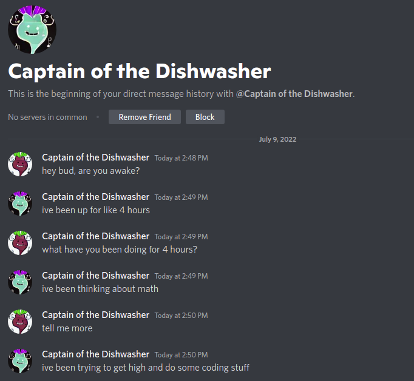

# The Evangelion Project

The Evangelion Project is an attempt to achieve human instrumentality (heavenbanning), wherein a Discord server is united as one entity (GPT-2) and can defeat invasive Angels (trolls).

The Evangelion Project has three phases, called *Impacts*. Each Impact contains a set of increasingly-complex goals that move us closer to human instrumentality.

We outline the goals for each of the Impacts below.

## The Prophecy

### (Done) First Impact

- (Done) Create a Github repository and documentation outlining the Evangelion Project
- (Done) Create Lilith, a python interface for using a trained GPT-2 model to generate discord messages
  - Lilith uses GPT-2 models which were fine-tuned on Discord DMs using [FriendSimulator](https://github.com/horenbergerb/FriendSimulator)
- (Done) Create Unit01, which connects Lilith to a Discord account and facilitates simple conversations

An example of Lilith generating dialogue (Output from `FirstImpact/DemoLilith.py`)

An example of Unit01 (the inverted logo) conversing with its creator (Output from `FirstImpact/DemoUnit01.py`)

### Second Impact

- (Done) Create a prototype Discord server
  - (Done) Create original channels and duplicate hidden channels
    - I created a category 'TEXT CHANNELS' for the real channels and another category 'TEXT CHANNEL' which contains the duplicates
    - We will refer to these as "real channels" and "heaven channels" respectively
  - (Done) Create two roles, one of which sees only the original channels, the other of which sees only the duplicates
    - I created the roles 'Default' and 'DefauIt', which are indiscernible in the default Discord font
- Create Evangelion for all of the users we intend to intimidate
  - Maybe 2-3 Discord accounts including Unit01
- Automatically duplicate messages from the real channels to the heaven channels
  - Create some python script that makes the Evangelion watch their creators and mimic them?
- Make Evangelion engage with Angels in the heaven channels
  - We can get as complex as we want with this
  - Not sure how deep we want to go

### Third Impact

- Contact Seong (Human Instrumentality Committee) and describe the Evangelion Project
  - If Seong is onboard then we are cookin'
- Discuss the possibility of training on TPM server logs
- Train GPT-2 model to emulate large Discord server
- Implement heaven channels in TPM
- Achieve human instrumentality